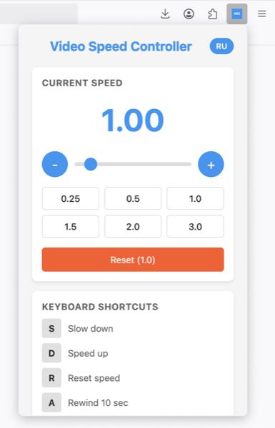

# Video Speed Controller

     

A cross-browser extension for controlling video playback speed on any website with keyboard shortcuts and visual indicators.

## Release

**Latest Version: 1.0.1**

- [Download for Chrome](https://github.com/euvar/video-speed-controller/releases/download/chrome-v1.0.1/video-speed-controller-chrome.zip) (Manifest V3)
- [Download for Firefox](https://github.com/euvar/video-speed-controller/releases/download/firefox-v1.0.1/video-speed-controller-firefox.zip) (Manifest V2)

## Screenshot



## Features

- **Wide Speed Range**: Control playback speed from 0.07x to 10.0x with 0.10 step increments
- **Keyboard Shortcuts**: Quick speed control without opening menus
  - `S` / `Ы` - Decrease speed
  - `D` / `В` - Increase speed
  - `R` / `К` - Reset speed to 1.0x
  - `V` / `М` - Toggle speed indicator visibility
- **Visual Speed Indicator**: Draggable on-screen display with auto-hide functionality
- **Dual Language Support**: English and Russian interface
- **Keyboard Layout Support**: Works with both English and Russian keyboard layouts
- **Speed Memory**: Optional setting to remember last used speed
- **Universal Compatibility**: Works on YouTube, Netflix, Twitch, and any website with HTML5 video

## Browser Support

- **Chrome** and Chromium-based browsers (Edge, Brave, Opera, Vivaldi)
- **Firefox**
- **Safari** (via conversion tools)

## Installation

### From Source

1. Clone or download this repository
2. Choose your browser:

#### Chrome/Edge/Brave
1. Open `chrome://extensions/` (or equivalent)
2. Enable "Developer mode"
3. Click "Load unpacked"
4. Select the `chrome` folder

#### Firefox
1. Open `about:debugging`
2. Click "This Firefox"
3. Click "Load Temporary Add-on"
4. Select any file in the `firefox` folder

### From Package

1. Run `./build.sh` to create distributable packages
2. Find packages in the `dist` folder:
   - `video-speed-controller-chrome.zip` for Chrome/Edge/Brave
   - `video-speed-controller-firefox.zip` for Firefox

## Project Structure

```
video-speed-controller/
├── chrome/              # Chrome extension (Manifest V3)
│   ├── manifest.json
│   ├── content.js
│   ├── popup.html/js/css
│   └── ...
├── firefox/             # Firefox extension (Manifest V2)
│   ├── manifest.json
│   ├── content.js
│   ├── popup.html/js/css
│   └── ...
├── build.sh            # Build script
└── README.md
```

## Technical Details

### Architecture

- **Content Script**: Injects speed control functionality into web pages
- **Popup Interface**: Settings and manual speed control
- **Background Script**: Handles extension lifecycle and communication
- **Browser Polyfill**: Ensures cross-browser compatibility

### Key Technologies

- **Manifest V3** for Chrome (modern security standards)
- **Manifest V2** for Firefox (full feature support)
- **Browser API Polyfill** for unified codebase
- **HTML5 Video API** for playback control
- **Vanilla JavaScript** - no frameworks or libraries
- **Native Browser APIs** - storage, tabs, runtime
- **CSS3** for animations and transitions

### Features Implementation

1. **Speed Control**: Direct manipulation of HTML5 video `playbackRate` property
2. **Indicator Positioning**: Absolute positioning with drag-and-drop support
3. **Auto-hide**: Timer-based opacity transitions
4. **Language Switching**: Dynamic DOM updates with translation system
5. **Keyboard Layout Support**: Key mapping for both Latin and Cyrillic characters

## Configuration

### Default Settings

- Speed range: 0.07x - 10.0x
- Speed step: 0.10
- Remember speed: Disabled by default
- Show indicator: Enabled
- Language: English
- Auto-hide delay: 2 seconds

### Customization

Settings can be modified through the extension popup interface.

## Browser Differences

### Chrome (Manifest V3)
- Service worker background script
- Declarative content scripts
- Action API instead of browser_action

### Firefox (Manifest V2)
- Persistent background page
- Browser action API
- Full webRequest API access

## Troubleshooting

### Video not responding to speed changes
- Ensure the video player is HTML5-based
- Some sites may override playback rate settings
- Try clicking on the video first to ensure focus

### Keyboard shortcuts not working
- Check if input fields are focused
- Some websites may intercept keyboard events
- Verify keyboard layout matches shortcut expectations

### Extension not loading
- Check browser developer mode is enabled
- Verify manifest version matches browser requirements
- Look for errors in browser console

## License

This project is provided as-is for educational and personal use.

## Contributing

Contributions are welcome. Please ensure:
- Code follows existing style conventions
- Cross-browser compatibility is maintained
- All text supports both English and Russian languages

## Security

This extension:
- Requires minimal permissions
- Does not collect any user data
- Does not make external network requests
- All processing happens locally in the browser